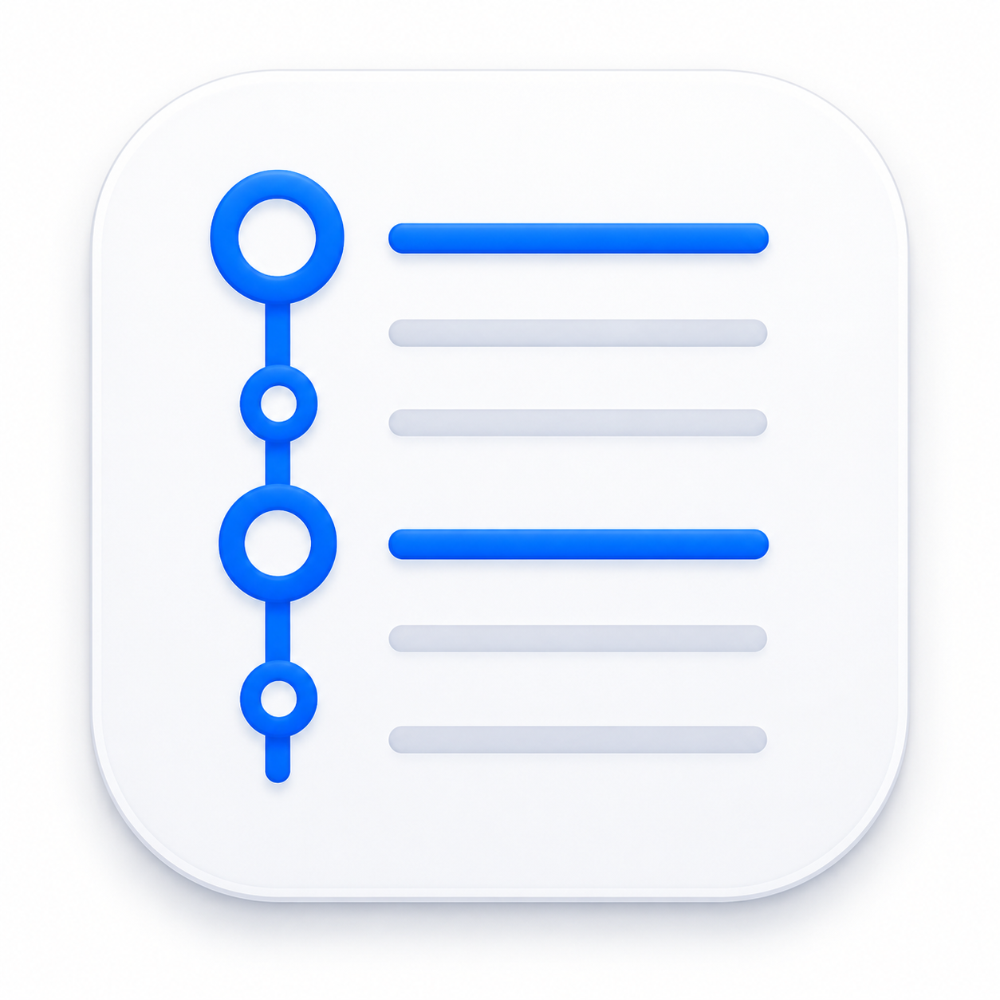
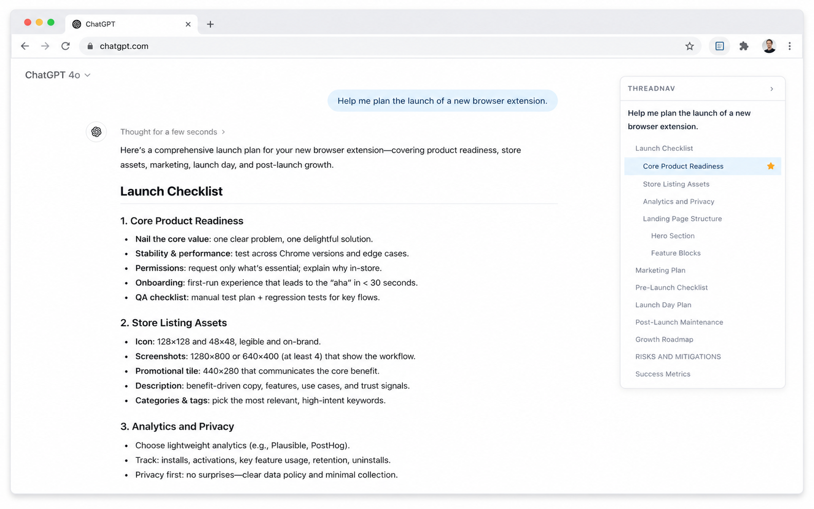

<p align="center">
  
</p>

# ChatGPT Thread Navigator

[](https://chromewebstore.google.com/detail/chatgpt-thread-navigator/noacnaakkdlmbamnenjmehiblnpekccm)
[](https://github.com/kylecwillis/chatgpt-thread-navigator/releases)
[](LICENSE)

A floating outline for long ChatGPT conversations. Works in Chrome, Edge, Brave, Arc, and any Chromium browser.

Long ChatGPT threads are powerful but hard to navigate. ThreadNav adds a small floating outline to the right side of `chatgpt.com` so you can jump through long threads like a document. It lists every question you've asked plus any `h1`/`h2`/`h3` headings from assistant responses. Click any item to smooth-scroll to that part of the thread. Star the ones you want to find again.



## Install

**[Add to Chrome from the Chrome Web Store](https://chromewebstore.google.com/detail/chatgpt-thread-navigator/noacnaakkdlmbamnenjmehiblnpekccm)** — one click, auto-updates.

Prefer to load it unpacked:

1. Download the [latest release zip](https://github.com/kylecwillis/chatgpt-thread-navigator/releases) and unzip it (or clone this repo)
2. Open `chrome://extensions`
3. Toggle **Developer mode** (top right)
4. Click **Load unpacked** and select the folder
5. Open or refresh `chatgpt.com`

## Features

- Floating outline of the current thread
- Lists every user prompt
- Detects `h1`/`h2`/`h3` headings in assistant responses
- Click to smooth-scroll
- Star/bookmark items, scoped per conversation, persisted locally
- Auto-updates while responses stream
- Light and dark mode match the page automatically
- Collapse to a thin tab; state persists across reloads
- No popup, no settings, no dependencies

## Privacy

- Runs entirely in your browser
- Only activates on `chatgpt.com`
- Does not read, store, or send your conversations
- No analytics, no network requests, no account

## Files

```
manifest.json   MV3 manifest, content-script registration
content.js      Outline build, scroll, observers, bookmarks
styles.css      Sidebar styling, light/dark variables
icon-*.png      Toolbar icons (16, 32, 48, 128)
media/          Source icon + screenshot (not shipped in the extension)
```

## License

MIT
